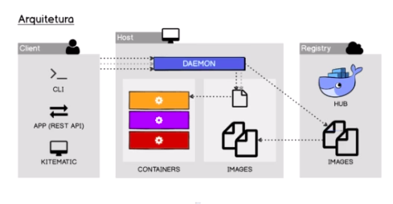

# Docker

* Docker é uma engine de administração de containers
* Container não é independente da máquina host, ele utiliza o kernel da máquina host
* Container são mais leves que VMS
* Container executam mais rápido que VM
* Containers, geralmente, são baseados em SOs Linux
* Docker criado em Go (Uhuuul)
* Containers possuem sua própria rede (isso pode ser mudado)

## Container

* Focar o container para lidar com apenas uma aplicação
* Segregação de processos no mesmo kernel
    * Processos do container são do container e do SO são do SO
* Sistema de arquivos isolado
* Containers são ambientes leves e portáteis
* Container ficam na memória do processador
* Container são baseados em imagems

## Imagens

* Modelo de sistema de arquivos usado para criar um container
* Imagens são geradas através de um build
* Imagems são formadas a partir de outras imagems
* Imagems são armazenadas em um registry ([artifactory](https://artifactory.softplan.com.br/ui/) ou [dockerhub](https://hub.docker.com/))
* Imagens são compostas de camadas
* Cada camada de uma imagem é uma alteração no sistema de arquivos
* Apenas a ultima camada pode ser alterada
* O objetivo das camadas é o reuso
* Imagens são criadas com o Dockerfile

## Arquitetura

## Instalação

[Instação do docker](https://docs.docker.com/engine/install/ubuntu/)

## Dockerfile

Reference: [Dockerfile](https://docs.docker.com/engine/reference/builder/)

Dockerfile é um arquivo de configuração que define a imagem docker

É vital que o nome do dockerfile esteja escrito corretamente (Dockerfile).

Referencia: [docker run](https://docs.docker.com/engine/reference/run/)
